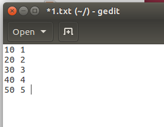
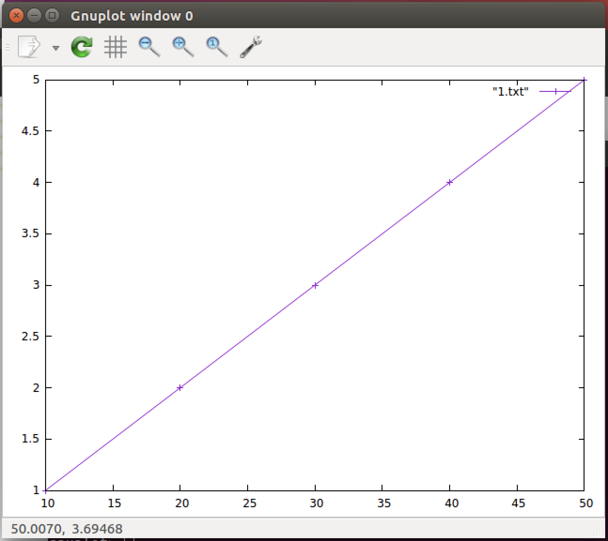
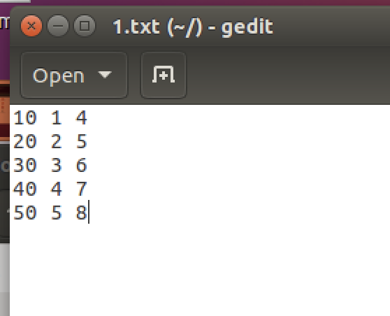
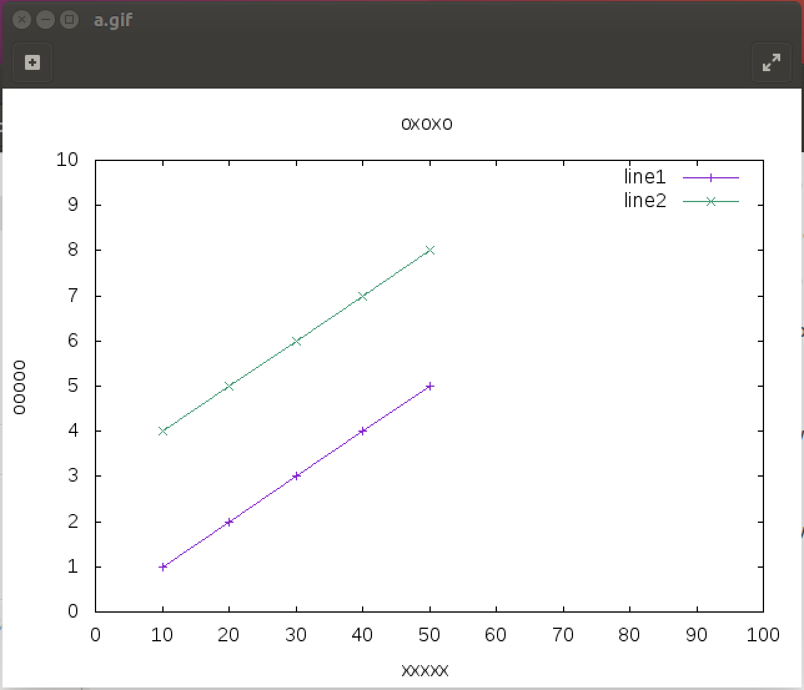

# GNUPLOT 指令繪圖
gnuplot是一套跨平臺的數學繪圖自由軟體。使用命令列介面，可以繪製數學函數圖形，也可以從純文字檔讀入簡單格式的座標資料，繪製統計圖表等等。它可以提供多種輸出格式，例如PNG，SVG，PS，HPGL，供文書處理、簡報、試算表使用。它並不是統計軟體或數學軟體。 gnuplot是有版權的，但自由分發；無須付費。(維基百科)


## setup
` sudo apt install gnuplot`
follow steps enter pwd

## 繪製單一曲線

### txt file
`gedit 1.txt &`


### gnuplot
進入 gnuplot `~$ gnuplot`
```
//繪製
> plot "1.txt" with linespoints
// 重新繪製
> replot
//輸出圖表
> set terminal gif
> set output "a.gif"
//退出
> exit
```

### output


## 繪製多曲線

### txt file


### gnuplot
```
//繪製兩條線
> plot "1.txt" using 1:2 with linespoints, "1.txt" using 1:3 with linespoints

//命名曲線
> plot "1.txt" using 1:2 title "line1" with linespoints, "1.txt" using 1:3 title "line2" with linespoints

//x軸設定
> set xrange [0:100] //區間
> set xtics 0,10,100 //間隔
> set xlabel "xxx" //項目名稱

//y軸設定
> set yrange [0:100] //區間
> set ytics 0,10,100 //間隔
> set ylabel "yyy" //項目名稱

//圖表名稱
> set title "oxoxo"
```

### output
